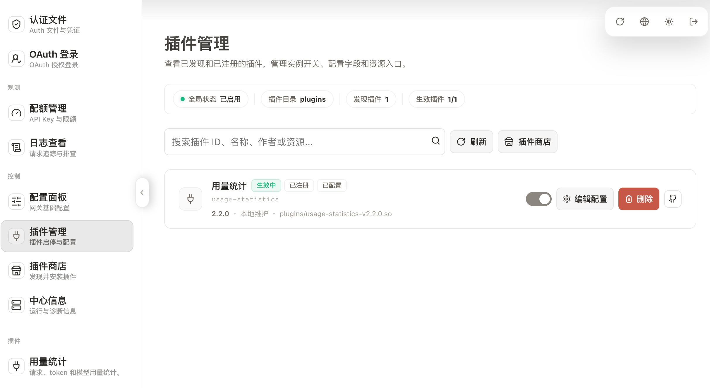
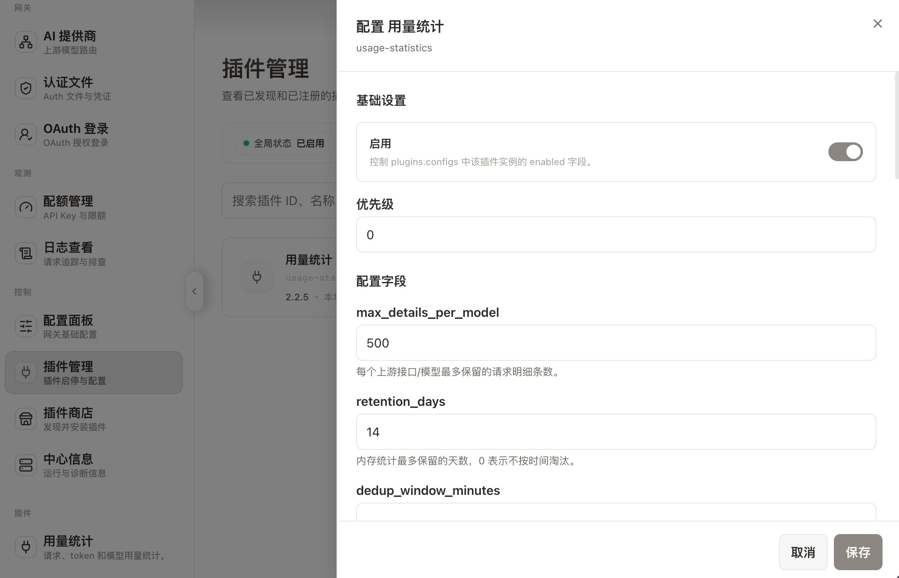
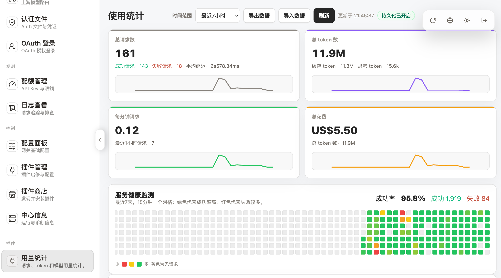
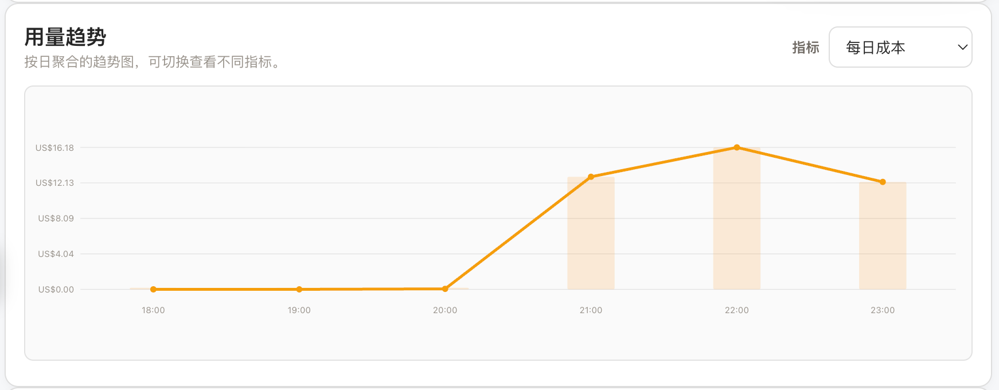
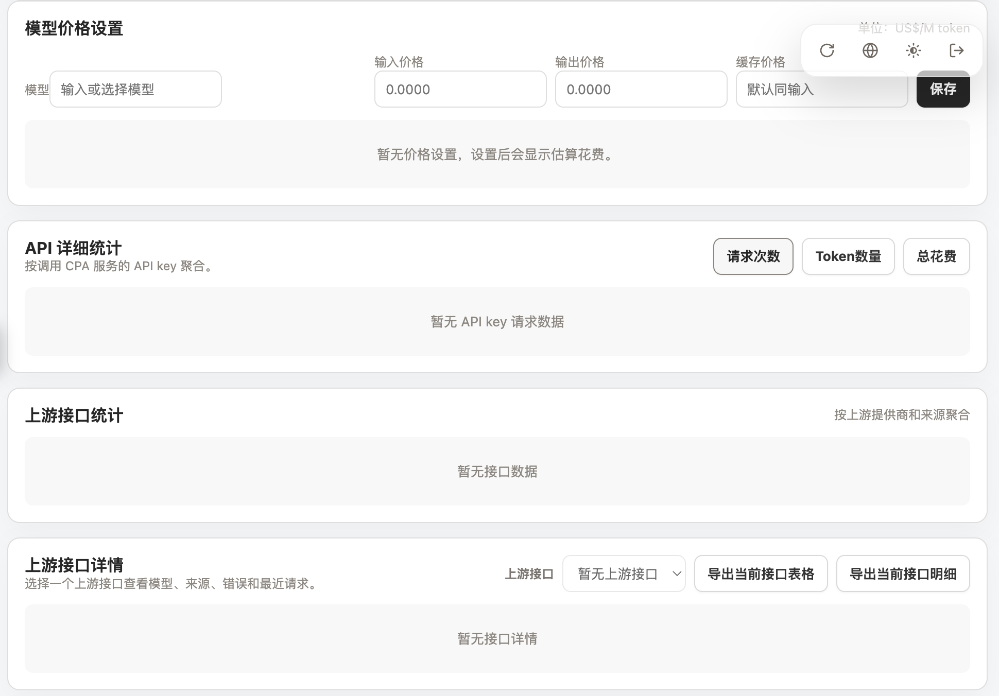
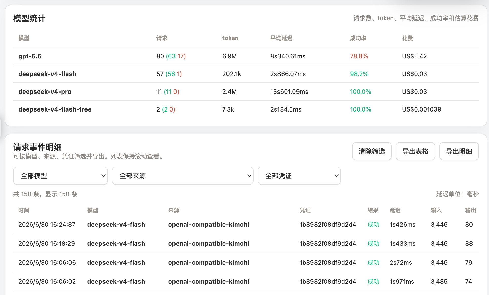

# CPA Usage Statistics Plugin

CPA 用量统计插件，用于在 CLIProxyAPI/CPA v7 插件系统中记录请求用量，并提供管理页面查看统计数据。

当前代码版本：`2.6.3`。

> **2.4.0 迁移提示**：插件 ID 已从 `usage-statistics` 改为 `usage-dashboard-zduu`，用于避开 CPA 官方商店中同 ID 插件造成的安装状态、配置和路由冲突。升级时必须先停用并删除旧插件，再安装新插件；历史统计数据路径保持不变。详细步骤见[部署文档的 2.3.4 → 2.4.0 迁移章节](docs/guides/cpa-usage.md#从-234-迁移到-240)。

`v1.0.0` 到 `v1.2.18` 属于规范化发布流程建立前的 legacy 历史版本；tag、release 和资产下载地址保持不变，说明见 [docs/releases/v1-history.md](docs/releases/v1-history.md)。

## 功能

- 记录请求数、成功/失败、延迟、TTFT。
- 记录 input/output/reasoning/cache/total token。
- 按上游接口、模型、来源、CPA 凭证和调用 CPA 的客户端 API key 聚合统计。
- API 详细统计支持主动选择脱敏后的客户端 API key，并联动筛选上游接口统计、上游接口详情、模型统计、请求事件明细和用量趋势；默认仍展示当前时间范围内的全量数据。
- 上游接口详情的最近请求展示推理强度、请求端点和生成速度；流式请求按首个 token 后的生成时长计算速度，非流式请求按完整响应耗时计算。
- 当前源码仅使用新版 CPA 的原生 usage 上报，取消所有模型的实时响应兜底和流式拦截，避免每个分片重复传输请求体、历史分片以及维护延迟匹配状态。旧版兜底记录仍支持历史去重修复。兼容依据和性能审查见 [资源使用审查](docs/issues/2026-09-06-resource-review.md)。
- 轻量级首屏摘要：看板数据不含请求明细，首包体积不随记录数增长。
- 请求事件明细支持按模型、来源、凭证、时间范围筛选，页面以滚动表格展示；来源列显示完整上游接口标识，便于区分同一 Codex、Claude 等提供商下的不同上游凭证。
- 服务健康网格按 15 分钟展示最近 7 天状态，鼠标悬停显示窗口信息。
- 用量趋势图支持切换每日成本、请求数、token 和平均 RPM，并提示近期用量突增或下降。
- 支持导入/导出统计数据，导出包含版本、插件版本、明细数和配置摘要；导入返回输入/接收/拒绝/新增/跳过/过期忽略明细。
- API key 只保存脱敏显示值和分组 hash；导入旧数据时会兼容无 hash 记录，但同一脱敏显示值下存在多个不同 hash 时不会强行合并，避免混淆不同真实 key。
- 支持后端全局模型价格表并分别按输入、输出、缓存读取、缓存写入 token 估算成本，跨设备打开看板可见同一份最新价格；手动价格可用 `provider/modelname` 区分同名上游模型，裸模型名作为所有上游的回退。
- 模型价格默认保存到 `data/usage-statistics-prices.json`，与推荐的持久化数据目录一起保留；使用默认路径且新文件不存在时，启动会自动迁移旧版本根目录的 `usage-statistics-prices.json`。显式配置旧路径或其他自定义路径时，继续在指定位置读写。
- 可选启用 models.dev 默认价格源，后端定时拉取价格表；手动设置的模型价格优先级更高，模型名匹配大小写不敏感。看板将价格查询与设置放在同一个默认收起的展开区，查询会搜索完整价格表、单次最多渲染 100 项并提示匹配总数；设置候选来自实际用量中出现过的 `provider/model`，裸模型名仍可直接输入作为全局回退，新上游模型无需先手动复制名称。
- 手动模型价格支持最多 16 条不重叠的时段覆盖规则，按 `pricing_timezone` 和请求发生时间选择价格；旧价格 JSON 未包含 `time_rules` 时保持原有全天价格语义。受明细保留上限淘汰的历史记录保留基础价格成本，仍保留的明细会应用精确的时段价格差额。
- 时段规则可限定星期，看板提供「每天 / 工作日 / 休息日」预设和逐日勾选；星期不相交的规则允许共用同一时间段（如工作日夜间半价、周末夜间原价），只有星期与时间同时相交才判为重叠。规则未写 `days` 即表示每天，旧价格文件语义不变。跨午夜的规则按请求实际落在的那一天判定：`22:00–06:00` 限定工作日时，周六凌晨不在该规则内。
- 看板金额可在 USD/CNY 间切换；USD/CNY 汇率由后端 HTTPS worker 获取并展示来源、更新时间及缓存/过期/回退状态，导出仍保留 USD。事件接口与 JSON 导出的每条记录都带 `cost_usd`（零价时段为显式 `0`），CSV 导出把该列追加在末尾。
- 模型统计展示成功率、缓存命中率、估算花费和实际单价（US$/M token），便于比较不同模型效率。
- 默认使用内存统计；可通过 `storage_enabled` + `storage_path` 开启后台队列 JSONL 持久化，配合周期 snapshot、旧分片清理和可选 fsync 在重启或更新插件后恢复保留窗口内的统计。
- 运行时元数据：页面可见当前保留策略、存储明细数、淘汰数、最近导入结果。
- 健康检查端点 `/health` 可查看插件运行状态、顶层 `alerts` 告警、持久化状态、后台 writer 批次/滑动平均/p95/p99/压力指标、看板查询/缓存指标、条件请求命中率和事件导出压力指标。
- 事件导出支持按筛选条件输出 JSON、CSV、JSONL，可通过 `gzip=1` 生成 gzip 文件内容，并用 `export_max_records`/`limit` 控制超大导出的返回行数；看板导出按钮默认使用后台导出任务，按页写入临时文件，生成完成后再下载结果。

## 界面示例

### 插件安装与启用



### 插件配置面板



### 概览看板与服务健康网格



### 用量趋势图



### 模型价格与接口统计



### 模型统计与请求事件明细



## 构建

本仓库使用 GitHub Actions 构建 Linux、macOS 和 Windows 插件。

1. 推送到 `main` / `master` 或手动运行 `Build Plugin` workflow。
2. CI 自动运行 Go 测试 (`go test -v -race ./...`) 和 JS 测试 (`node --test`)。
3. 在 Actions 运行结果中下载对应架构 artifact，例如 `usage-dashboard-zduu-plugin-linux-amd64`。
4. Release 中会上传按平台命名的资产，例如 `usage-dashboard-zduu-linux-amd64.so`、`usage-dashboard-zduu-darwin-arm64.dylib`、`usage-dashboard-zduu-windows-amd64.dll`，并保留 `usage-dashboard-zduu.so` 作为 `linux-amd64` 兼容别名。
5. CI 同时生成插件商店兼容的 zip 资产（`usage-dashboard-zduu_{version}_{goos}_{goarch}.zip`）和 `checksums.txt`，可直接用于 CPA 插件商店一键安装。

自 `v2.0.0` 起，发布说明以 [docs/releases/changelog.md](docs/releases/changelog.md) 为准，并由 workflow 在打 `vX.Y.Z` tag 时校验版本号并生成 GitHub Release。

本地构建（需要 Go 1.26+ 和 CGO）：

```bash
cd go
CGO_ENABLED=1 GOOS=linux GOARCH=amd64 go build -buildmode=c-shared -buildvcs=false -trimpath -ldflags="-s -w" -o ../usage-dashboard-zduu.so .
```

本地交叉构建 arm64 需要安装对应 C 交叉编译器，例如 `aarch64-linux-gnu-gcc`：

```bash
cd go
CC=aarch64-linux-gnu-gcc CGO_ENABLED=1 GOOS=linux GOARCH=arm64 go build -buildmode=c-shared -buildvcs=false -trimpath -ldflags="-s -w" -o ../usage-dashboard-zduu-linux-arm64.so .
```

本地测试：

```bash
cd go && go test -v -race ./...
node --check go/dashboard/helpers.js go/dashboard/i18n.js go/dashboard/script.js
node --test go/dashboard/*.test.js
```

## 目录

```text
cpa-usage-plugin/
├── .github/workflows/build.yml
├── registry.json           # 插件商店注册表
├── README.md
├── docs/
│   ├── README.md
│   ├── guides/
│   │   └── cpa-usage.md
│   ├── releases/
│   │   ├── changelog.md
│   │   └── v1-history.md
│   └── images/
│       └── readme/
│           ├── plugin-management.png
│           ├── plugin-configuration.png
│           ├── dashboard-overview.png
│           ├── usage-trends.png
│           ├── pricing-and-api-stats.png
│           └── model-and-events.png
├── scripts/
│   ├── extract-release-notes.sh
│   └── update-latest-release.sh
└── go/
    ├── go.mod
    ├── main.go              # CGO 入口 + 分发器 + 信封工具
    ├── types.go             # 全部数据结构
    ├── stats.go             # 统计引擎 + 摘要 + limit/offset 事件查询
    ├── source.go            # 密钥脱敏 / 来源清洗 / 响应头过滤
    ├── register.go          # 注册 / 配置 / YAML 解析
    ├── management.go        # 管理接口路由 + 处理器
    ├── dashboard.go         # go:embed 前端嵌入 + 摘要/事件 API
    ├── dashboard_export_jobs.go  # 后台导出任务
    ├── main_test.go         # 原有测试
    ├── dashboard_test.go    # 新 API 测试
    └── dashboard/
        ├── index.html       # 纯 HTML 结构
        ├── style.css        # 纯 CSS
        ├── helpers.js       # 可单测的纯函数
        ├── helpers.test.js  # JS 单元测试
        └── script.js        # JS 主逻辑
```

## 管理接口

插件注册以下管理接口：

```text
GET  /v0/management/plugins/usage-dashboard-zduu/usage
GET  /v0/management/plugins/usage-dashboard-zduu/usage/export
POST /v0/management/plugins/usage-dashboard-zduu/usage/import
GET  /v0/management/plugins/usage-dashboard-zduu/model-prices
PUT  /v0/management/plugins/usage-dashboard-zduu/model-prices
DELETE /v0/management/plugins/usage-dashboard-zduu/model-prices
GET  /v0/management/plugins/usage-dashboard-zduu/dashboard-summary
GET  /v0/management/plugins/usage-dashboard-zduu/dashboard-events
GET  /v0/management/plugins/usage-dashboard-zduu/dashboard-events-export
POST /v0/management/plugins/usage-dashboard-zduu/dashboard-events-export-jobs
GET  /v0/management/plugins/usage-dashboard-zduu/dashboard-events-export-jobs
DELETE /v0/management/plugins/usage-dashboard-zduu/dashboard-events-export-jobs
GET  /v0/management/plugins/usage-dashboard-zduu/dashboard-events-export-download
GET  /v0/management/plugins/usage-dashboard-zduu/dashboard-api-detail
GET  /v0/management/plugins/usage-dashboard-zduu/dashboard-data
GET  /v0/management/plugins/usage-dashboard-zduu/health
```

### 接口说明

| 端点 | 方法 | 说明 |
|------|------|------|
| `/usage` | GET | 获取完整统计数据（含明细）。 |
| `/usage/export` | GET | 导出全量统计数据（JSON），包含 `version`、`plugin`、`detail_count`、`config` 和 `usage`。 |
| `/usage/import` | POST | 导入统计数据，返回 `input_records`/`accepted_records`/`rejected_records`/`added`/`skipped`/`ignored_by_retention`。 |
| `/model-prices` | GET/PUT/DELETE | 获取、新增/更新、删除全局模型价格表。 |
| `/dashboard-summary` | GET | **推荐** — 轻量看板摘要，不含请求明细，含预计算健康网格/来源/客户端 API/模型聚合和 `_meta` 元数据；可传 `client_api` 使用摘要返回的不可逆 selector 筛选。 |
| `/dashboard-events` | GET | 事件查询，支持 `?limit=50&offset=0&range=24h&model=gpt-4&source=xxx&auth=xxx&api=xxx&client_api=xxx`；每条事件的可选 `api` 字段为完整上游接口分组键。 |
| `/dashboard-events-export` | GET | 按筛选条件导出事件，默认 JSON；支持 `format=csv|jsonl`、`gzip=1` 和 `limit`，默认受 `export_max_records` 保护。`gzip=1` 返回 gzip 文件内容，不使用 `Content-Encoding`。 |
| `/dashboard-events-export-jobs` | POST/GET/DELETE | 创建、查询或删除后台事件导出任务，参数与 `/dashboard-events-export` 一致。 |
| `/dashboard-events-export-download` | GET | 下载已完成的后台事件导出任务结果，使用 `?id=<job_id>`。 |
| `/dashboard-api-detail` | GET | 单个上游接口详情，支持 `?api=xxx&range=24h&client_api=xxx`，返回模型分布、来源、错误统计和最近请求；最近请求携带完整上游接口 `api`，并在有数据时返回推理强度 `thinking`、请求端点 `endpoint` 和流式标记 `stream`。 |
| `/dashboard-data` | GET | 兼容旧版，返回含全部 `details` 数组的完整数据。 |
| `/health` | GET | 运行健康状态：`status`、`alerts`、`detail_count`、`evicted_total`、`total_requests`。 |

`/dashboard-summary`、`/dashboard-events`、`/dashboard-api-detail` 和 `/dashboard-events-export` 支持弱 ETag；内置看板轮询会自动使用 `If-None-Match`，外部脚本也可用条件请求减少未变化数据的重复传输。`/health.runtime.conditional_requests` 会按端点统计条件请求的 304 命中率。

浏览器资源入口由插件注册到 CPA 管理端，菜单名为"用量统计"。

## 使用说明

安装和启用步骤见 [docs/guides/cpa-usage.md](docs/guides/cpa-usage.md)。
